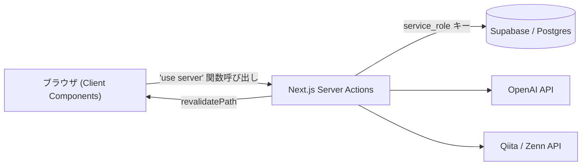

# TechPulse Dashboard 設計書

技術記事のURLを登録すると、AIが要約・参照シーン・主要コマンドを抽出してナレッジとして蓄積し、後から自然言語で検索・整理できるようにするダッシュボードアプリ。

## アーキテクチャ概要

- フレームワーク: Next.js（App Router / Server Actions）
- DB: Supabase（Postgres）。サーバー側は `service_role` キーを優先使用し、ブラウザから直接DBを叩くことはない（[セキュリティ方針](common/security.md) 参照）
- AI: OpenAI `gpt-4o-mini`（記事解析・自然言語クエリの意図/キーワード展開）
- 外部データソース: Qiita API / Zenn API（未登録記事の発見用）

ブラウザはSupabaseクライアントを一切import せず、すべてのDB読み書きは `src/app/actions/*.ts`（Server Actions）を経由する。この境界を崩さないことが [セキュリティ方針](common/security.md) の前提になっている。

## 機能一覧

| 機能 | 概要 |
|---|---|
| [URLを直接入力して記事を登録する](features/register-by-url.md) | 記事URLを貼るとAIが解析してストックに保存する |
| [自然言語で記事を発見・登録する](features/discover-and-register.md) | 自然言語の質問からQiita/Zennの記事候補を探し、選んで登録する |
| [保存済み記事を検索する](features/search-saved-articles.md) | ストック済み記事を自然言語・タグで絞り込む |
| [記事の削除（個別・一括）](features/delete-articles.md) | 個別削除・複数選択一括削除・絞り込み範囲の全選択 |
| [ダークモード切り替え](features/theme-toggle.md) | システム設定連動 + 手動トグル、FOUCなしの実装 |

## 共通仕様

| ドキュメント | 内容 |
|---|---|
| [セキュリティ方針](common/security.md) | SSRF対策、エラーメッセージの扱い、Supabaseアクセス制御 |
| [データモデル](common/data-model.md) | `articles` / `commands` テーブル定義とER図 |
