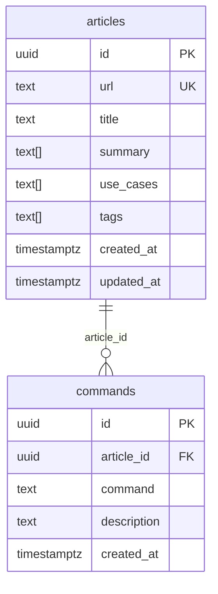

# データモデル

[← 設計書トップ](../README.md)

## ER図

- `articles.url` は一意制約があり、[URLを直接入力して記事を登録する](../features/register-by-url.md) で同一URLの重複登録を防いでいる（Postgresエラーコード `23505` で検知）
- `commands` は1記事に対して複数（AIが抽出した主要コマンド・コード引用の数だけ）ひもづく

## 型定義とSupabaseクライアントの整合性

[`src/types/database.ts`](../../src/types/database.ts) がこのER図をTypeScriptの型として表現し、`createClient<Database>()`（[`src/lib/supabase.ts`](../../src/lib/supabase.ts)）に渡すことで、`.from('articles').insert(...)` 等の呼び出しに型チェックが効くようにしている。

このプロジェクトが使用する `@supabase/postgrest-js` のバージョンでは、各テーブルの型が `Relationships` を持ち、スキーマ全体が `Views` / `Functions` を持つ形（`GenericSchema`）でないと、insert/update の引数型が `never` に潰れて型チェックが機能しなくなる。`database.ts` はこの形に合わせて、`commands` に `articles` への外部キー情報（`Relationships`）を、スキーマ全体に空の `Views` / `Functions` を明示している。

## 主に利用する箇所

| テーブル | 主な利用機能 |
|---|---|
| `articles` | [URLを直接入力して記事を登録する](../features/register-by-url.md)（insert）、[保存済み記事を検索する](../features/search-saved-articles.md)（一覧取得元）、[記事の削除](../features/delete-articles.md)（delete） |
| `commands` | 同上（記事に付随する形で登録・削除される） |

## 関連機能

- [URLを直接入力して記事を登録する](../features/register-by-url.md)
- [保存済み記事を検索する](../features/search-saved-articles.md)
- [記事の削除（個別・一括）](../features/delete-articles.md)
- [セキュリティ方針](security.md) — アクセス制御（`service_role` キー運用）
