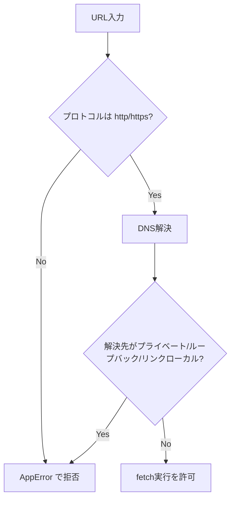

# セキュリティ方針

[← 設計書トップ](../README.md)

このアプリには認証機構がなく、URLを知っていれば誰でもすべてのServer Actionを呼び出せる前提で設計している。そのため「入力を信用しない」「内部情報を露出しない」を徹底する方針を採る。

## SSRF対策

[URLを直接入力して記事を登録する](../features/register-by-url.md) は、ユーザーが指定した任意のURLをサーバーから `fetch` する。認証がない以上、これは `localhost` や社内ネットワーク、クラウドのメタデータエンドポイント（`169.254.169.254` 等）への到達に悪用され得る。

`assertPublicHttpUrl`（[`src/lib/urlSafety.ts`](../../src/lib/urlSafety.ts)）で以下を検証する。

1. プロトコルが `http:` / `https:` のみであること
2. ホスト名をDNS解決し、解決先アドレスがループバック・プライベート・リンクローカル（メタデータIPを含む）でないこと

**既知の限界**: DNS解決はリクエスト時点の一度きりであり、DNSリバインディング（検証時と実際のfetch時で異なるIPを返す攻撃）を完全には防げない。実際に接続するIPを固定するにはNode標準の `fetch` の外側でTCP接続を制御する必要があり、単一オーナーの個人ツールという性質上、費用対効果を鑑みて未対応としている。マルチテナント化・認証追加時は再検討が必要。

## エラーメッセージのサニタイズ

Server Actionは失敗時に `{ success: false, error: string }` を返すが、Supabase/OpenAI SDKの生の例外メッセージをそのまま返すと、内部実装の手がかり（DBエラー詳細やライブラリのスタック情報）が無認証の呼び出し元に漏れる。

`AppError` / `toClientMessage`（[`src/lib/errors.ts`](../../src/lib/errors.ts)）で区別する。

- `AppError` として意図的に投げたメッセージ（例:「このURLの記事はすでに登録されています」）→ そのままクライアントに表示
- それ以外の例外（DB接続エラー、JSON parse失敗など）→ 汎用メッセージのみクライアントに返し、詳細は `console.error` でサーバー側にのみ記録

この方針は以下の4つのServer Actionすべてに適用されている。

- [`addArticleByUrl`](../features/register-by-url.md)
- [`searchArticlesByQuery`](../features/discover-and-register.md)
- [`expandSemanticQuery`](../features/search-saved-articles.md)
- [`deleteArticles`](../features/delete-articles.md)

## Supabaseアクセス制御

- `src/lib/supabase.ts` は `SUPABASE_SERVICE_ROLE_KEY`（サーバー限定の秘密鍵）を優先使用し、未設定時のみ `NEXT_PUBLIC_SUPABASE_ANON_KEY` にフォールバックする
- Supabaseクライアントを import しているのはServer Component（`page.tsx`）とServer Action（`src/app/actions/*.ts`）のみで、`'use client'` コンポーネントからは一切importされていない —— ブラウザは常にNext.jsのServer Actionを経由し、Supabaseと直接通信しない
- anonキーに対するテーブルの直接権限（`GRANT`）は現在拒否される設定になっている（アプリの実際の読み書きはすべて `service_role` 経由のため、anonロールに権限を残す必要がない）

## 入力サイズの制限

認証もレート制限もない状態でOpenAI呼び出しにつながる入力を無制限に受け付けると、コスト濫用やレイテンシ増大につながる。以下の箇所で長さ上限を設けている。

- [`addArticleByUrl`](../features/register-by-url.md) の対象URL: `assertPublicHttpUrl` 内で2000文字まで
- [`searchArticlesByQuery`](../features/discover-and-register.md) の検索クエリ: 500文字まで
- [`expandSemanticQuery`](../features/search-saved-articles.md) の検索クエリ: 500文字まで

## 今後の検討事項（未対応）

- **認証**: 現状は誰でも登録・削除・AI呼び出しができる。個人用ツールとして許容している前提だが、公開URLを他者と共有する場合は要検討
- **レート制限**: サーバーレス環境が前提のため、インメモリ実装では信頼できず、Upstash Redis等の外部ストアが必要になる
