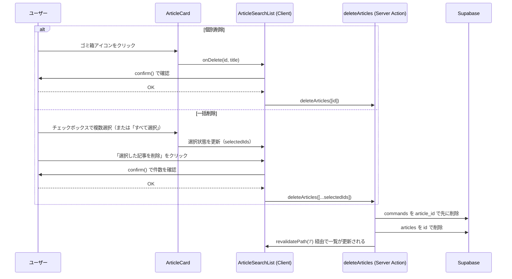

# 記事の削除（個別・一括）

[← 設計書トップ](../README.md)

## 概要

ストックした記事を取り消す機能。カードごとの個別削除に加え、チェックボックスで複数選択して一括削除できる。「すべて選択」は [保存済み記事を検索する](search-saved-articles.md) の絞り込み結果にスコープされ、絞り込み中は絞り込み結果のみが選択対象になる。

## UI

- `ArticleCard`（`src/components/ArticleCard.tsx`）: チェックボックス + ゴミ箱アイコン（個別削除）
- `ArticleSearchList`（`src/components/ArticleSearchList.tsx`）: 選択状態の管理、「すべて選択」トグル、選択中バー（件数・選択解除・一括削除ボタン）

## 処理フロー

## 選択スコープの設計

`isAllFilteredSelected` / `handleToggleSelectAll`（[`src/components/ArticleSearchList.tsx`](../../src/components/ArticleSearchList.tsx)）は、常に**表示中の `filteredArticles`（[保存済み記事を検索する](search-saved-articles.md) の絞り込み結果）のみ**を対象にする。絞り込みを変えても選択状態自体は保持されるが、「すべて選択」ボタンが選択・解除するのはその時点で画面に見えている記事に限られる。

## 削除処理の設計

`deleteArticles`（[`src/app/actions/deleteArticle.ts`](../../src/app/actions/deleteArticle.ts)）は、外部キーのカスケード削除設定に依存せず、常に `commands` を先に `article_id` で削除してから `articles` を削除する。DB側の外部キーが未設定・カスケード無効であっても安全に動作する設計。

## 主要ファイル

- [`src/components/ArticleCard.tsx`](../../src/components/ArticleCard.tsx) — 個別削除UI・選択チェックボックス
- [`src/components/ArticleSearchList.tsx`](../../src/components/ArticleSearchList.tsx) — 選択状態管理・一括削除UI・全選択ロジック
- [`src/app/actions/deleteArticle.ts`](../../src/app/actions/deleteArticle.ts) — `deleteArticles` 本体
- [`src/lib/errors.ts`](../../src/lib/errors.ts) — エラーメッセージの整形（詳細は [セキュリティ方針](../common/security.md)）

## 関連機能

- [保存済み記事を検索する](search-saved-articles.md) — 「すべて選択」の対象範囲を決める絞り込みロジック
- [データモデル](../common/data-model.md) — `articles` / `commands` の関係

## 既知の制約

- 削除確認は `window.confirm()` によるブラウザ標準ダイアログ（デザインの統一されたモーダルではない）
- 認証がないため、URLを知っていれば誰でも削除操作を実行できる
