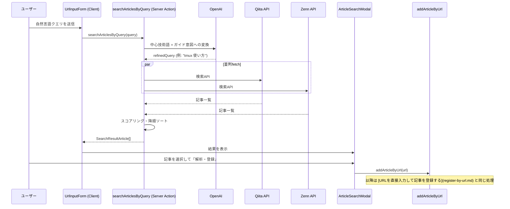

# 自然言語で記事を発見・登録する

[← 設計書トップ](../README.md)

## 概要

「まだURLを知らない」状態から、自然言語の質問（例:「Spring BootでDockerイメージを小さくビルドする方法」）を起点にQiita/Zennの記事候補を探し、良さそうなものを選んでストックに登録する機能。最終的な登録処理は [URLを直接入力して記事を登録する](register-by-url.md) と共通の `addArticleByUrl` に合流する。

## UI

- `UrlInputForm`（`src/components/UrlInputForm.tsx`）の「自然言語で検索して登録」タブ
- 検索結果は `ArticleSearchModal`（`src/components/ArticleSearchModal.tsx`）にモーダル表示

## 処理フロー

## スコアリングの仕組み

`searchArticlesByQuery`（[`src/app/actions/searchArticles.ts`](../../src/app/actions/searchArticles.ts)）は、取得した記事を単なる新着順ではなく「関連度」で並べ替える。

| 条件 | 加点 |
|---|---|
| タグが対象技術と完全一致 | +100 |
| タイトルに対象技術を含む | +80 |
| タイトルにガイド系キーワード（使い方・入門・解説など）を含む | +60 |
| 本文抜粋にガイド系キーワードを含む | +20 |
| いいね数（上限50） | 最大+50 |

スコア150以上かつ最上位の記事には `ArticleSearchModal` 上で「おすすめ解説」バッジが表示される。

## 主要ファイル

- [`src/components/UrlInputForm.tsx`](../../src/components/UrlInputForm.tsx) — 入力フォーム（検索モード）
- [`src/components/ArticleSearchModal.tsx`](../../src/components/ArticleSearchModal.tsx) — 検索結果モーダル
- [`src/app/actions/searchArticles.ts`](../../src/app/actions/searchArticles.ts) — `searchArticlesByQuery` 本体
- [`src/app/actions/addArticle.ts`](../../src/app/actions/addArticle.ts) — 選択後の登録処理（[詳細](register-by-url.md)）
- [`src/lib/constants.ts`](../../src/lib/constants.ts) — Qiita/Zenn取得時のUser-Agent定義

## 関連機能

- [URLを直接入力して記事を登録する](register-by-url.md) — この機能の「登録」部分の実体
- [保存済み記事を検索する](search-saved-articles.md) — 似た自然言語検索だが、こちらは**未登録**の外部記事が対象。登録済み記事に対する検索は別実装（`expandSemanticQuery`）

## 既知の制約

- Qiita/Zennいずれかの検索APIが失敗しても `Promise.allSettled` により処理は継続する（部分的な結果でも表示する設計）
- 検索クエリは500文字を上限とし、OpenAI呼び出しコストの濫用を軽減している
