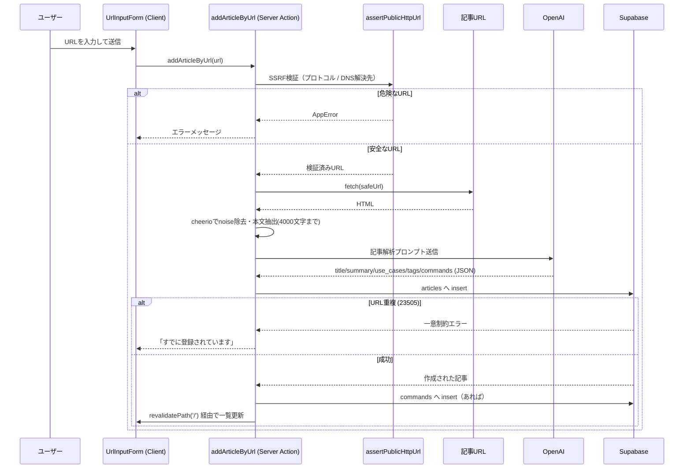

# URLを直接入力して記事を登録する

[← 設計書トップ](../README.md)

## 概要

ユーザーが技術記事のURLを入力すると、サーバー側でページ本文を取得し、AIが「要約」「参照シーン」「タグ」「主要コマンド」を抽出してストックに保存する。[保存済み記事を検索する](search-saved-articles.md) や [削除する](delete-articles.md) 対象になる、ストックの入り口となる機能。

## UI

- `UrlInputForm`（`src/components/UrlInputForm.tsx`）の「URLで直接登録」タブ
- 送信中はボタンが「解析中...」表示になり、二重送信を防止

## 処理フロー

## 主要ファイル

- [`src/components/UrlInputForm.tsx`](../../src/components/UrlInputForm.tsx) — 入力フォーム（URLモード）
- [`src/app/actions/addArticle.ts`](../../src/app/actions/addArticle.ts) — `addArticleByUrl` 本体
- [`src/lib/urlSafety.ts`](../../src/lib/urlSafety.ts) — SSRF対策（詳細は [セキュリティ方針](../common/security.md)）
- [`src/lib/errors.ts`](../../src/lib/errors.ts) — `AppError` / クライアント向けメッセージの整形
- [`src/prompts/articleAnalysis.md`](../../src/prompts/articleAnalysis.md) — AI解析用プロンプトテンプレート
- [`src/types/database.ts`](../../src/types/database.ts) — `articles` / `commands` の型（詳細は [データモデル](../common/data-model.md)）

## 処理の要点

- 本文抽出時に `script/style/nav/footer/header/iframe` を除去し、先頭4000文字のみAIに渡す（コスト・ノイズ削減）
- AIレスポンスは `response_format: json_object` で取得し、`JSON.parse` 失敗時は `AppError` として扱う（生の解析結果は失敗理由に含めない）
- `commands` の保存失敗は致命的エラーにせず、ログのみ出力して `articles` の登録自体は成功させる

## 関連機能

- [自然言語で記事を発見・登録する](discover-and-register.md) — 候補記事を選んだ後、この機能と同じ `addArticleByUrl` を呼び出して登録する
- [保存済み記事を検索する](search-saved-articles.md) — 登録した記事はここで検索対象になる
- [記事の削除（個別・一括）](delete-articles.md) — 登録した記事を取り消す

## 既知の制約

- SSRF対策はリクエスト時点のDNS解決に基づくため、DNSリバインディングに対する完全な防御ではない（[セキュリティ方針](../common/security.md) 参照）
- 認証・レート制限がないため、誰でもこのアクションを呼び出せる（OpenAI利用コストの濫用余地がある）
