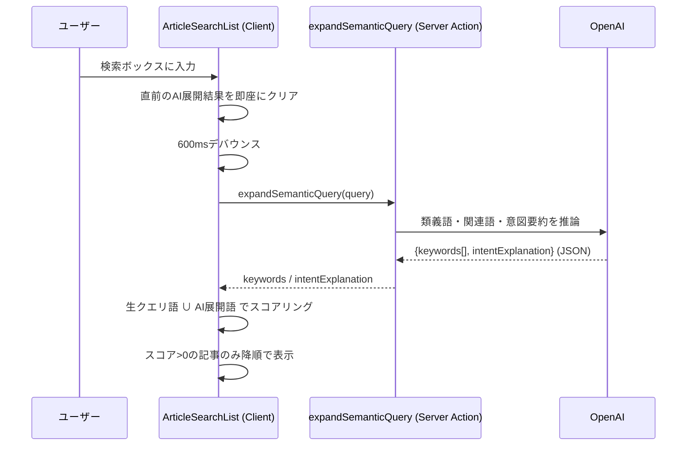

# 保存済み記事を検索する

[← 設計書トップ](../README.md)

## 概要

ストック済みの記事を、キーワードの完全一致ではなく自然言語のニュアンスで検索できるようにする機能。「シェルスクリプトの1行目って何？」のような曖昧な質問でも、AIが類義語（シェバン / shebang / `#!` など）を展開し、それらを含む記事をヒットさせる。タグによる絞り込みも同じ一覧に統合されている。

未登録記事をQiita/Zennから探す [自然言語で記事を発見・登録する](discover-and-register.md) とは対象データが異なる（こちらは**登録済み**の記事が対象）別実装であることに注意。

## UI

- `ArticleSearchList`（`src/components/ArticleSearchList.tsx`）
- 検索ボックス、AIの解釈（意図説明・展開キーワードのバッジ）、タグ絞り込みバー、記事一覧を1コンポーネントで管理

## 処理フロー

## スコアリングの仕組み

`ArticleSearchList` 内 `filteredArticles`（[`src/components/ArticleSearchList.tsx`](../../src/components/ArticleSearchList.tsx)）が本体。**DB検索ではなく、ページロード時に取得済みの全記事に対してブラウザ側で文字列マッチ + スコアリングする**点が実装上の要点。

1. `title` / `summary` / `use_cases` / `tags` / `commands`（command+description）を連結して検索対象文字列を作る
2. 生のクエリ語（分かち書き）とAI展開キーワードの和集合を作る
3. 各語が検索対象文字列に部分一致するか判定（`java` のみ `javascript` との誤マッチを避けるため単語境界チェックあり）
4. 生クエリ語の一致は+2点、AI展開語の一致は+1点
5. スコア0の記事は除外し、スコア降順でソート

タグ絞り込み（`selectedTag`）はこのスコアリングの前段でANDフィルタとして適用される。

## 主要ファイル

- [`src/components/ArticleSearchList.tsx`](../../src/components/ArticleSearchList.tsx) — 検索・絞り込み・一覧表示の中心
- [`src/app/actions/semanticSearch.ts`](../../src/app/actions/semanticSearch.ts) — `expandSemanticQuery` 本体
- [`src/components/ArticleCard.tsx`](../../src/components/ArticleCard.tsx) — 個々の記事カード表示（サイトfavicon・タグ・要約・削除操作を含む）

## 関連機能

- [記事の削除（個別・一括）](delete-articles.md) — 「絞り込み結果をすべて選択」はこの検索・絞り込み結果（`filteredArticles`）に連動する
- [URLを直接入力して記事を登録する](register-by-url.md) — 検索対象となる記事はここで登録される

## 既知の制約

- クライアント側の全件走査のため、記事数が大きくなるとスケールしない（将来的にはDB側の全文検索やベクトル検索への置き換えを検討する余地がある）
- AI展開のレスポンスが返るまでの間は生クエリ語のみでの部分一致検索にフォールバックする（体感速度優先の設計）
