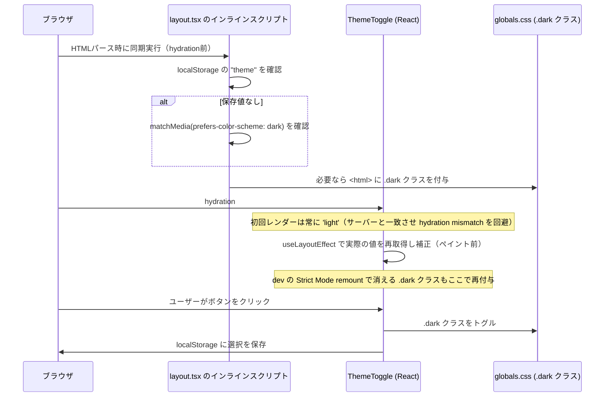

# ダークモード切り替え

[← 設計書トップ](../README.md)

## 概要

画面右上の固定ボタンでライト/ダークを切り替えられる。初回表示時はローカルストレージの保存値、なければOSのシステム設定（`prefers-color-scheme`）に従う。Next.js が案内する FOUC（Flash of Unstyled Content）防止パターン（`node_modules/next/dist/docs/01-app/02-guides/preventing-flash-before-hydration.md`）に沿い、hydration前に実行するインラインスクリプト + `suppressHydrationWarning` を採用しており、テーマ切り替え時のちらつきが発生しない。

## UI

- `ThemeToggle`（`src/components/ThemeToggle.tsx`）— 全ページ共通で `layout.tsx` の `<body>` 直下に常時表示される固定ボタン

## 処理フロー

## hydrationミスマッチを避ける設計

サーバーはクライアントの `localStorage` やOS設定を知り得ないため、常に `'light'` としてレンダリングする。もし `ThemeToggle` の初期状態を `localStorage` から即座に読もうとすると、サーバー出力（'light' 固定）とクライアントの初回レンダーが食い違い、React の hydration エラーになる。これを避けるため、

1. React の初期状態は常に `'light'`（サーバーと一致）
2. 実際の値は `useLayoutEffect`（ペイント前に同期実行）で読み込み、状態を補正

という二段構えにしている（詳細なコメントは [`src/components/ThemeToggle.tsx`](../../src/components/ThemeToggle.tsx) 内に記載）。

## 主要ファイル

- [`src/components/ThemeToggle.tsx`](../../src/components/ThemeToggle.tsx) — トグルボタン本体
- [`src/app/layout.tsx`](../../src/app/layout.tsx) — FOUC防止用インラインスクリプト、`suppressHydrationWarning`
- [`src/app/globals.css`](../../src/app/globals.css) — `.dark` クラス配下の配色定義（ライト/ダークともに青系アクセントカラーを使用）

## 関連機能

特定の機能とは独立した横断的なUI機能。全ページ・全コンポーネントの配色（[URLを直接入力して記事を登録する](register-by-url.md) のフォームや [保存済み記事を検索する](search-saved-articles.md) の一覧など）に影響する。

## 既知の制約

- テーマの永続化は `localStorage` のみ（複数デバイス間で同期されない、サーバーサイドでのユーザー設定保存は行っていない）
